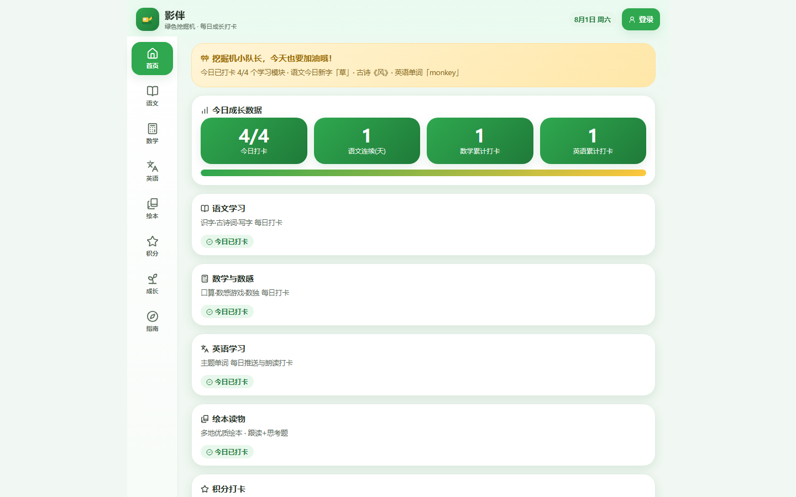
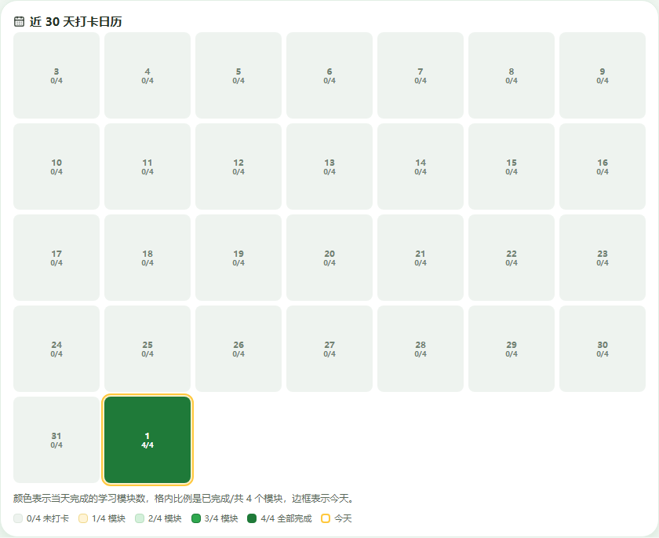
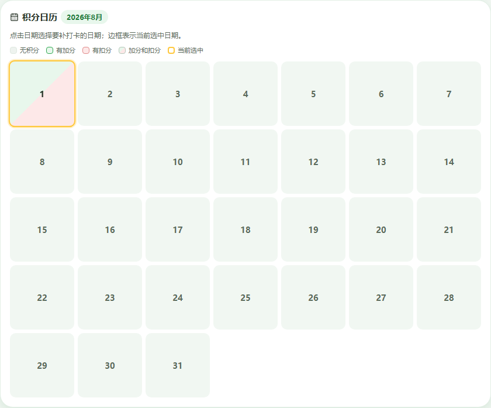

# Shadow Mate

<p align="center">
  
</p>

<p align="center">
  <strong>Turn everyday learning into visible growth.</strong><br>
  A family learning check-in PWA for learning, records, and sync in one place.
</p>

<p align="center">
  <code>v1.3.12</code> · <a href="./LICENSE">MIT License</a> · Vite + Vanilla JavaScript + Supabase
</p>

<p align="center">
  <a href="./README.zh-CN.md">简体中文</a> ·
  <a href="https://sm.shadow.wang/"><strong>Open Shadow Mate</strong></a> ·
  <a href="./docs/user-guide.md">User guide</a> ·
  <a href="./RELEASE_NOTES.md">Release notes</a>
</p>

## Product overview

Shadow Mate is designed around a family's daily learning routine: what was learned today, which tasks were completed, and how consistently the habit is growing.

<p align="center">
  
</p>

<p align="center"><sub>The screenshots use local demo data and contain no real family information.</sub></p>

## What it does

- **Four learning modules**: Chinese, mathematics, English, and picture books; tasks can be checked in or cancelled independently.
- **One learning entry**: open “学习” (Learning) in the left navigation first, then choose Chinese, mathematics, English, or picture books; Points, Growth, and Guide remain separate top-level pages.
- **Growth records**: completion is summarized by learning module over the last 30 days, with daily progress shown as `completed/4`.
- **Points calendar**: behavior points are recorded separately from learning modules and can be reviewed or backfilled by date.
- **Family space**: one parent manages multiple learners, with records loaded for the active learner.
- **Shared account sign-in**: email verification and shared email-password authentication for Shadow products.
- **Duplicate-action protection**: rapid repeated submissions, syncs, deletions, and check-ins are guarded against duplicate changes.
- **Offline-first**: learning, check-ins, points, and picture-book records work locally before sign-in; cloud sync is optional after sign-in.
- **Cross-device recovery**: optimistic versioning and conflict protection reduce accidental overwrites across devices.

## Screenshots

### Growth calendar: see consistency, not just task counts

<p align="center">
  
</p>

The growth calendar counts each learning module once per day. For example, Chinese character practice, poetry, and writing are separate tasks but count as one Chinese module; picture books are the fourth module. A `4/4` day means all four learning modules were completed.

### Points calendar: keep behavior feedback separate

<p align="center">
  
</p>

The points calendar distinguishes no points, positive points, negative points, and mixed activity on the same date. It does not change the four-module growth calendar.

## Statistics

| Page | Measures | Date states |
| --- | --- | --- |
| Home | Learning modules completed today | `completed/4` |
| Growth | Learning-module completion over the last 30 days | `0/4` to `4/4`; yellow border marks today |
| Points | Behavior-point records for the current month | none, positive, negative, or mixed; yellow border marks the selected date |

## Quick start

### Use the application

```bash
npm ci
npm run dev
```

Open the local URL printed by Vite. Do not open `index.html` directly with `file://`; browser modules require the development server.

The local privacy page is available at [http://localhost:5173/privacy](http://localhost:5173/privacy). It is served by the same Vite development server as the main application.

### Validation

```bash
npm run check
npm run build
npm run test:fast
npm run test:ui
```

For database-backed checks, start Docker Desktop first:

```bash
npm run local-dev
npm run local-dev -- plan --projects shadow-mate --json
```

## Local development boundaries

The canonical local entry coordinates shared Supabase, Mailpit, database tests, and Edge Functions. It reuses healthy resources with matching identity and only starts missing resources:

```bash
npm run local-dev
```

The shared local Supabase API is local-only and Mailpit is available at [http://127.0.0.1:54324](http://127.0.0.1:54324). A feature worktree that starts Vite directly does not automatically start Mailpit or switch to local Supabase; configure its loopback Supabase URL and publishable key explicitly.

Non-production and Preview sources must not connect to production Supabase. Remote production access is blocked unless an explicitly authorized temporary verification override is provided. Never put production credentials or service-role keys in this repository.

Compatibility wrappers remain available when only the split entry points are needed:

```bash
npm run supabase:local:start
npm run supabase:local:functions:serve
```

Do not run a bare `supabase start` in the repository root as a replacement for the shared local entry.

For local database linting:

```bash
cd ../shadow-size/merchant-admin
npx supabase db lint --local --schema public --level warning --fail-on error
```

Choose the smallest sufficient validation scope for ordinary changes. Run `npm run test:full` before merging or releasing.

## How it works

```text
Browser-local state
      │
      ├─ Signed out: offline learning, check-ins, points, and picture books
      │
      └─ Family sign-in
              │
              ├─ Learner-scoped records
              ├─ Versioned multi-device sync
              └─ RLS and product-boundary protection
```

- Local learning state is stored in browser storage and scoped to the active learner.
- Cloud state is stored as versioned JSON snapshots. Network failure must not destroy local state.
- If a learner switch cannot confirm the complete active scope, the application fails closed and pauses local and cloud writes. The protection survives refreshes until a parent explicitly clears local data.
- Clearing local data keeps fail-closed protection until both local storage and Growth Loop IndexedDB have been cleared successfully.
- Deleting a family removes Shadow Mate's associated family data without deleting the shared Auth identity.
- Full identity deletion is enabled only in an isolated Supabase project with an explicitly authorized server-side flow.

## Repository structure

```text
src/app.js                 UI rendering, interaction, and local state
src/learning-state.js      Learning state machine and module grouping
src/cloud.js               Authentication, family space, sync, export, and deletion
src/action-lock.js         Duplicate-action and async-operation guards
src/icons.js               Lucide icon rendering and hydration
supabase/migrations/       Migration proposals and isolated CI test copies
supabase/functions/        Account-level server functions
tests/unit/                Pure-function and state-machine tests
tests/e2e/                 Offline, cloud, and data-lifecycle tests
```

## Supabase and security boundary

The browser uses only a publishable Supabase key. Data isolation is enforced by Supabase RLS, household membership, and product identity. Never expose a secret or service-role key in browser code.

This repository contains migration proposals and isolated CI test copies. Production migrations are managed by the Shadow Portal control plane. Do not run production `db push`, `migration repair`, `--include-all`, linked SQL, or manual `schema_migrations` edits from this repository.

The local Supabase profile and migration sources are checked by the shared local-development contract. This local contract does not grant production migration permissions.

## Current release boundary

Shadow Mate is an open-source family learning PWA. It has no advertising and no independent child accounts. Anonymous, aggregated page-visit data may be collected through [Vercel Web Analytics](https://vercel.com/docs/analytics/privacy-policy). See [Privacy](PRIVACY.md) for data scope and deletion behavior, and [Security](SECURITY.md) for private vulnerability reports.

## Speech fallback

“Listen” uses the matching system voice when it is reliable, then falls back to one browser-local `matcha-icefall-zh-en` package for both Mandarin and English. The first fallback downloads and validates the 154.6 MB package from `voice.shadow.wang`; after that, synthesis works offline in the same browser profile and origin. Chrome, Quark, Xiaomi Browser, private profiles, and different domains cannot share Cache Storage, so each requires its own download. The package replaced separate Piper voices because the Chinese Piper model mispronounced isolated characters in both browser and native inference, while the Matcha model passed product-owner listening checks for Chinese and English words and sentences. The accepted first version has a noticeably mechanical timbre. Shadow Mate does not collect microphone recordings.

## Acknowledgements

The active speech fallback uses:

- [sherpa-onnx](https://github.com/k2-fsa/sherpa-onnx) (Apache-2.0): audited WebAssembly TTS runtime
- [matcha-icefall-zh-en](https://k2-fsa.github.io/sherpa/onnx/tts/all/Chinese-English/matcha-icefall-zh-en.html): one Chinese-English model distributed through `voice.shadow.wang`

The repository temporarily retains the following deprecated Piper assets only for historical compatibility and safe cache migration:

- [piper-tts-web](https://github.com/Poket-Jony/piper-tts-web) (MIT): browser Piper engine wrapper
- [pinyin-pro](https://github.com/zh-lx/pinyin-pro) (MIT): Chinese Pinyin phoneme conversion for the Chaowen voice
- [rhasspy/piper](https://github.com/rhasspy/piper) (MIT): lightweight neural speech synthesis
- [ONNX Runtime Web](https://github.com/microsoft/onnxruntime) (MIT): browser inference runtime
- [rhasspy/piper-voices](https://huggingface.co/rhasspy/piper-voices): the `en_US-ljspeech-medium` and `zh_CN-chaowen-medium` voice models distributed through `voice.shadow.wang`

See [THIRD_PARTY_NOTICES.md](THIRD_PARTY_NOTICES.md) for source, version, and license details.

## Documentation

| Document | Purpose |
| --- | --- |
| [Chinese README](README.zh-CN.md) | Complete Chinese product and development guide |
| [User guide](docs/user-guide.md) | Sign-in, family space, check-ins, sync, speech, and installation |
| [Logo usage](docs/logo-usage.md) | Adopted Shadow Mate Logo usage |
| [Release notes](RELEASE_NOTES.md) | English user-facing changes |
| [Chinese release notes](RELEASE_NOTES.zh-CN.md) | Chinese user-facing changes |
| [Release Notes template](docs/release-notes-template.md) | Authoring rules and structure |
| [Third-party notices](THIRD_PARTY_NOTICES.md) | Included libraries and assets |
| [Privacy](PRIVACY.md) · [Security](SECURITY.md) | Data and responsible disclosure policies |

## Contact

I share product and AI-building work across several channels:

- X: [@Gollumgulu](https://x.com/Gollumgulu)
- WeChat Official Account: **Ward 的 AI 产品实战**
- Xiaohongshu / Weibo / Douyin: **Ward 的 AI 产品实战** — [Xiaohongshu](https://xhslink.cn/m/4W1NWyRrxv5) · [Weibo](https://weibo.com/u/8344390431) · [Douyin](https://v.douyin.com/1y06PMohfoE/)
- Product site: [Shadow Nexus](https://www.shadow.wang/)
- Email: [wardlu@126.com](mailto:wardlu@126.com)

## License

The code is released under the [MIT License](LICENSE). Third-party content, models, and trademarks remain the property of their respective owners.
