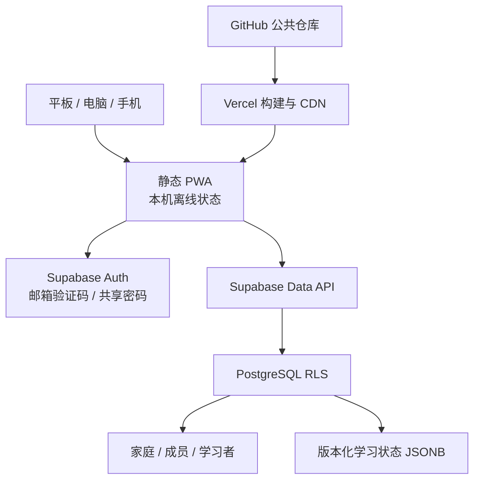
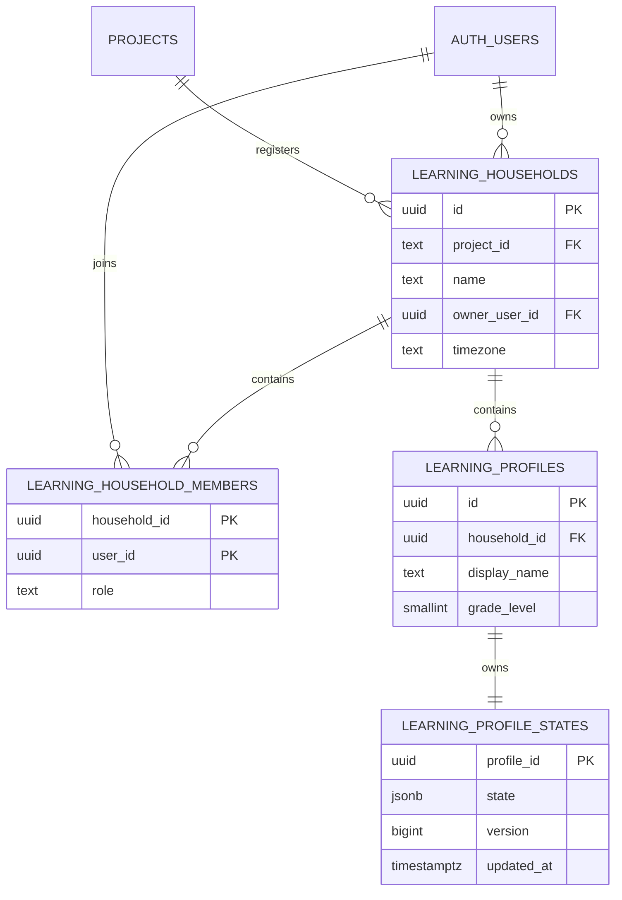

# Shadow Mate（影伴）架构与实施方案

版本：2.1
日期：2026-08-01
状态：核心架构与第一阶段已实施

## 1. 结论

影伴适合继续采用“静态 PWA + Supabase + GitHub + Vercel”，但不应照搬旧设计中的 `profiles.parent_id + 12 张内容/用户表`。

本次实施采用两层租户模型：

1. **产品租户**：复用现有 `public.projects`，以 `shadow-mate` 登记影伴，不改现有商业化系统的 `users / subscriptions / credits`。
2. **家庭租户**：每个家庭是独立 household；家长账号通过 membership 加入家庭；儿童是家庭内 learner profile，不强迫儿童拥有邮箱或 Supabase Auth 账号。

当前学习数据继续使用与原 localStorage 兼容的 JSONB 状态快照，并增加版本号做乐观并发控制。这比一次性拆成大量细表更适合当前产品：能完整迁移现有功能、减少回归风险，同时保留将高价值事件逐步规范化的路径。

## 2. 对旧设计的评审

### 2.1 值得保留

- PWA 是正确载体：同一网址覆盖平板、电脑和手机。
- GitHub → Vercel 的发布链路适合静态前端。
- Supabase Auth + PostgreSQL + RLS 适合浏览器直接访问。
- localStorage 保留为离线缓存和迁移来源是正确方向。
- 多设备同步、一个家长管理多个孩子应作为基础能力。

### 2.2 必须调整

| 旧设计 | 问题 | 新设计 |
| --- | --- | --- |
| `profiles.parent_id` | 只能表达一个家长；难以支持共同监护、家庭转移和邀请 | `learning_households + learning_household_members` 多对多关系 |
| 学生也是 Auth 用户 | 儿童必须有邮箱/手机号，增加未成年人隐私和账号管理负担 | 只有家长/监护人认证；儿童是 learner profile |
| `profiles` 所有人可读 | 会泄露昵称、家庭关系和儿童档案 | 所有学习表仅家庭成员可读 |
| 前端读取 `role` 控 admin | UI 隐藏不等于授权，容易形成 BOLA/IDOR | 所有写权限由数据库 RLS 决定 |
| 公开 schema 的 `SECURITY DEFINER is_accessible()` | 默认执行权限和绕过 RLS 都有风险 | 保存函数使用 `SECURITY INVOKER`；授权逻辑由表策略执行 |
| 一开始拆 12 张表 | 与现有代码映射成本高，内容模型尚未稳定，容易过度设计 | 先迁移完整状态；需要统计或检索时再拆事件/内容表 |
| 内容全部进数据库 | 当前内容是公开、随代码发布的小数据；入库只增加延迟和运维 | 内容先版本化在仓库；编辑器或付费内容出现后再建内容服务 |
| `tier_required` 由前端判断 | 付费内容仍可被直接请求 | 未来由服务端 entitlement/RLS 判定，不把 UI 隐藏当权限 |
| “永久免费额度”静态结论 | SaaS 配额、价格和条款会变化 | 以供应商当前控制台和官方文档为准，设置用量告警 |

### 2.3 现有共享数据库的真实约束

现有项目名为 `monetization-service`，已有多个产品共用：

- `projects`：产品登记
- `users`：统一用户表
- `subscriptions / credits / transactions`：商业化能力

其中 `public.users` 的主键只有 `auth.users.id`，不是 `(user_id, project_id)`。这意味着同一个 Auth 用户不能自然地在该表中拥有多个产品身份。因此本项目：

- 复用 `projects` 登记产品；
- 不把学习台家庭/孩子模型塞进 `public.users`；
- 新表统一使用 `learning_` 前缀；
- 将来若复用付费能力，再以 `auth.users.id + project_id='shadow-mate'` 查询订阅，不让付费表成为学习数据的所有者。

## 3. 运行时架构

关键性质：

- 无自建常驻后端。
- publishable key 可在浏览器出现；安全边界是 RLS。
- 本机模式无需登录，网络恢复后仍可使用。
- 云端状态写入通过版本号检测并发冲突。
- 浏览器永远不持有 `service_role` 或 secret key。

## 4. 数据模型

### 为什么当前使用 JSONB 状态

原应用的所有变更都围绕一个约 1 MB 以下的小状态对象。JSONB 状态具备：

- 使用唯一的 `shadow_mate_workbench_v1` 本机存储命名空间；
- 一次原子保存，减少部分成功导致的数据不一致；
- 新增前端字段时不必立即发数据库迁移；
- 便于在第一阶段完整保持旧功能。

限制与演进条件：

- 如果需要排行榜、日级报表或推荐模型，应新增 append-only `learning_activity_events`；
- 如果内容编辑频繁或需要付费授权，应新增内容集合、内容项和 entitlement 表；
- 如果状态接近 1 MB、冲突频率升高或查询需要跨用户聚合，应将相关字段拆表；
- 不直接删除 JSONB 状态；先双写、回填、验证，再切换读取。

## 5. 身份、权限和儿童隐私

### 5.1 身份边界

- 家长/监护人：Supabase Auth 用户。
- 同一 Supabase Auth 用户在 Shadow 系列产品间共用邮箱密码；产品只负责品牌化登录界面和回跳，不复制身份或密码。
- 学习者：家庭内 profile，不是 Auth 用户。
- 家庭成员角色：`owner / guardian / viewer`。
- 角色存数据库 membership，不使用可由用户自行修改的 `user_metadata` 做授权。

### 5.2 RLS 原则

- `anon` 对所有 `learning_*` 表无权限。
- `authenticated` 仍必须通过家庭 membership 才能访问行。
- 创建家庭时 `owner_user_id` 必须等于 `auth.uid()`。
- 家庭 owner 只能为自己创建初始 owner membership。
- owner/guardian 可创建和修改 learner profile/state。
- 创建 learner profile 还必须存在当前 owner/guardian 的 `privacy-v1` 家长同意记录；同意记录只允许服务端默认时间戳写入，客户端无更新/删除权限。
- `learning_save_state` 是 `SECURITY INVOKER`，不会绕过 RLS。
- `learning_is_household_owner` 是唯一的 `SECURITY DEFINER` 授权辅助函数：固定空 `search_path`、仅返回当前用户是否为指定家庭 owner、仅授予 `authenticated` 执行权，用于打断 household 与 membership 策略之间的递归。
- 更新策略同时具有 `USING` 与 `WITH CHECK`。
- 所有 RLS 子查询都有相应索引。

### 5.3 最小化儿童数据

第一阶段只保存：

- 显示名称
- 年级
- 学习状态

不保存生日、学校、真实姓名、地址、精确位置、照片或儿童邮箱。新增任何儿童敏感字段前，先完成必要性、保留期限、删除流程和家长同意评审。
家长同意和儿童隐私的工程记录见 [儿童隐私与家长同意审核](child-privacy-and-consent.md)；这不是特定司法辖区的法律清权。

## 6. 同步与冲突处理

1. 所有操作先写 localStorage，保证离线体验。
2. 登录并选择学习者后，读取 `learning_profile_states`。
3. 云端为空时，上传旧版本机状态。
4. 两端都有数据时：
   - 打卡、积分、书架和已读标记按 key 合并；
   - 阅读日志按 `date + title + rating` 去重；
   - 本机保留一份。
5. 保存时传入 `expected_version`。
6. 数据库版本不一致则返回 `learning_state_conflict`。
7. 客户端重新读取、合并并最多重试 2 次，每次逐步退避；超过上限则触发熔断（`cloudSyncBlocked`），暂停自动同步，直到用户手动点击同步按钮重试。避免多标签页冲突风暴。

这不是通用 CRDT，但足以覆盖家庭低并发、离线打卡场景；比“最后写入覆盖全部数据”安全。

## 7. 内容策略

现阶段汉字、古诗、英语单词和书单继续放在版本化代码中，原因：

- 内容量小、更新频率低；
- 公开仓库中的内容本来就不能靠前端字段实现付费保护；
- 数据结构还会随真实使用调整；
- 静态内容可随 PWA 缓存，离线稳定。

以下条件出现时进入内容服务阶段：

- 非开发人员需要内容编辑器；
- 按教材、学期或地区发布多个版本；
- 需要审核、发布、撤回和版权追踪；
- 需要真正的付费内容授权。

届时建议模型为：

- `learning_content_collections`
- `learning_content_versions`
- `learning_content_items`
- `learning_entitlements`

付费判断必须由数据库策略或受信服务完成，不能仅依赖前端 `tier_required`。

## 8. 前端与 PWA

本次没有把原应用重写成 React/Next.js。当前项目是一个中小型交互式工具，静态 HTML/JS 的维护成本和部署复杂度更低。已实施：

- 原功能和视觉保留；
- 单独的 `src/cloud.js` 云同步层；
- 单独的 `src/cloud.css` 响应式和账户 UI；
- `src/app.js` 与 `src/app.css` 从 index.html 拆出，CSP 不再依赖 `unsafe-inline`；
- `manifest.json` 与 192/512/maskable 图标；
- Service Worker 应用壳和运行时缓存；
- 宽屏下扩大布局，不再锁死 460 px；
- 静态构建脚本，无 npm 依赖下载；
- Supabase JS 固定到 `2.111.0`。
- CSP 的 `script-src` 和 `style-src` 均为 `'self'`，不含 `unsafe-inline`。
- 当前过渡版本的 Piper 本地语音使用 `connect-src blob:` 读取浏览器生成的模块/模型资源，使用 `media-src 'self' blob:` 播放合成音频，并使用 `wasm-unsafe-eval` 支持 WASM 初始化；不允许通用的 `unsafe-eval`。该路径计划从商业构建移除。
- 目标 TTS 路线保留设备 `speechSynthesis` 优先；系统语音不可用时请求自托管 MeloTTS API，浏览器只接收和缓存生成的音频。动态文本会离开浏览器，必须纳入隐私、日志和子处理者设计。
- `vite.config.js` 当前仍为 Piper 过渡资源提供开发兼容处理；MeloTTS 迁移完成后应删除仅服务 Piper 的构建兼容代码。

若未来管理后台、内容编辑器、支付和服务端页面成为主体，再迁移到 TypeScript + React/Next.js；不为“可能有一天”提前承担框架成本。

## 9. 商业化边界

公共 Core 继续保持完整可用和 MIT License。官方 Cloud 当前继续免费提供；未来 Billing、Entitlement、Quota、AI Prompt/Router、Premium Content 和运营后台进入独立的私有 Services 层。Core 只消费版本化 Capability snapshot，不直接读取 `subscriptions`、`credits` 或支付表，也不把前端 UI 隐藏当成安全授权。

具体契约和未完成的商业化闸门见 [商业化边界](commercialization-boundary.md)。
