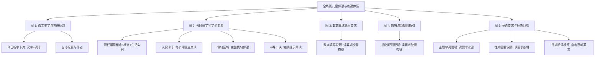

# 全场景儿童点读与题目伴读设计方案（第二期）
Child-Friendly Voice Prompts & Tap-to-Read Design Spec (Phase 2)

- **状态**：方案拟定（待评审）
- **日期**：2026-09-07
- **分支**：`feat/growth-loop-redemption-lifecycle`
- **输入来源**：用户标注的 5 张交互截图（图 1 ~ 图 5）

---

## 一、 背景与用户核心诉求

### 1.1 问题现状
在幼儿（3~7 岁）日常使用 Shadow Mate 学习打卡过程中，儿童普遍存在**“识字量有限、不识长句，但听觉理解力强”**的认知特点。

在上期 MVP 中，我们落地了：
- 古诗分行点读与整首诵读
- 口算强化题目的“读题目”按钮（“五加三等于几？”）与内联大按键键盘
- 正向反馈动效（爆星、大字表扬、防挫摇晃）与糖果色视觉

根据本次用户提供的 5 张核心界面圈注（图 1 ~ 图 5），应用中仍有若干关键区域缺少听觉支持，导致低龄儿童面对界面时无法独立理解题意或进行词句跟读，需要家长在旁反复代念。

### 1.2 本期目标
为 5 张截图所圈注的全部场景补充符合儿童认知习惯的点读与伴读支持，使低龄儿童在无需家长协助的情况下，通过轻触即可“听懂题目、听清字词、听明指引”。

---

## 二、 5 大截图场景详细拆解与朗读设计



### 场景 1（图 1 - 语文模块：今日新字卡片与古诗标题）
1. **今日新字微卡片（`c1` / `c2`）**：
   - **元素**：`.grid2 .mini-card`（如 `月 / yuè / 月儿`、`水 / shuǐ / 水果`）
   - **交互定义**：
     - 将卡片设为可点读元素（`role="button"`, `tabindex="0"`, `aria-label="朗读汉字：月，月儿"`）。
     - 点击卡片时，朗读：“`{字}，{词语}`”（例如：“月，月儿”），给孩子建立“字-音-词”对应关联。
     - 增加触控反馈样式：悬停与 `:active` 微缩放，朗读时右上角浮现温和音波/小喇叭微动效。
2. **背诵古诗词标题与作者**：
   - **元素**：`.poem-box .poem-title` 与 `.poem-box .poem-meta`（如 `《小池》 杨万里 · 人教版`）
   - **交互定义**：
     - 点击标题或作者区域触发朗读：“`古诗《{题目}》，{作者}`”（例如：“古诗《小池》，杨万里”）。
     - 增加触控光标与 `aria-label="朗读诗名与作者：小池，杨万里"`。

---

### 场景 2（图 2 - 今日图字学习·写字：4 处要素点读）
在图字卡片中，当前已具备「中文发音」、「英文发音」和「朗读字意」3 个独立按钮，但图文结合的其他 4 处关键区域孩子同样想点、想听：
1. **顶栏插画概念卡（`.hanzi-visual`）**：
   - **元素**：含 Emoji/图标、概念标签、英文标签与辅助描述（如 `🔟 数字十 ten 十个小手指`）。
   - **交互定义**：点击该区域朗读：“`{概念中文名}，{生活实例描述}`”（例如：“数字十，十个小手指”），滤除原生 emoji 符号，发音清晰自然。
2. **“认识词语”标签条（`.hanzi-example-word`）**：
   - **元素**：例词标签（如 `十天`、`十个`）。
   - **交互定义**：每个词语标签设为独立点击点读项，点击朗读对应词语（“十天” / “十个”），点击时伴随轻量弹性放大微动效。
3. **例句整行（`.hanzi-sentence`）**：
   - **元素**：如 `例句：十个小手指。`
   - **交互定义**：点击例句整行朗读完整句子（“例句：十个小手指。”），增加鼠标悬停手型与下划线或轻微背景加深。
4. **书写口诀黄色提示条（`.hanzi-writing-hint`）**：
   - **元素**：如 `先写横，再写竖，交叉在中间。`
   - **交互定义**：点击黄色口诀卡朗读笔画提示文本（“先写横，再写竖，交叉在中间。”），强化孩子在临摹写字时的口诀记忆。

---

### 场景 3（图 3 - 数学：数感星球·数字填写题目说明）
1. **元素**：`.card .desc` -> `点击问号格，选出它应该是哪个数字（按 1 递增顺序）。`
2. **交互定义**：
   - 将文案容器布局升级为弹性横排（`.desc-with-audio`），右侧放置胶囊型伴读按钮：
     ```html
     <div class="desc desc-with-audio">
       <span>点击问号格，选出它应该是哪个数字（按 1 递增顺序）。</span>
       <button class="btn-read-prompt" type="button" aria-label="朗读题目要求">${icon("volume")} 读要求</button>
     </div>
     ```
   - 点击「读要求」按钮，朗读文本：“点击问号格，选出它应该是哪个数字，按一递增顺序。”（针对数字“1”优化为中文字“一”，发音更自然）。
   - 朗读期间按钮呈播放中状态，再次点击不重复叠播。

---

### 场景 4（图 4 - 数学：数独游戏规则指引）
1. **元素**：`.card .desc` -> `把 1-4 填入每行每列（4×4 入门版，含比较/分类/形状思维）。`
2. **交互定义**：
   - 同样升级为 `.desc-with-audio` 布局，配备「读规则」胶囊按钮：
     ```html
     <div class="desc desc-with-audio">
       <span>把 1-4 填入每行每列（4×4 入门版，含比较/分类/形状思维）。</span>
       <button class="btn-read-prompt" type="button" aria-label="朗读游戏规则">${icon("volume")} 读规则</button>
     </div>
     ```
   - 朗读语音清洗纯净文本：“把一到四填入每行每列，四乘四入门版，含比较、分类、形状思维。”，确保 TTS 准确流畅表达数学规则。

---

### 场景 5（图 5 - 英语模块：说明文案与往期单词听音）
1. **今日主题单词任务说明**：
   - **元素**：`.card .desc` -> `拼读并朗读下面的单词，读完点「完成今日打卡」。`
   - **交互**：增加内联「读指引」胶囊按钮，朗读该句任务引导，告知幼童下一步操作。
2. **往期单词回看说明**：
   - **元素**：`.card .desc` -> `按月回看之前朗读过的单词（最近 7 天）：`
   - **交互**：增加内联「读指引」胶囊按钮，朗读该句说明。
3. **往期单词芯片（`.mr-chip` 如 `cold`、`hot`、`small`、`big`）**：
   - **元素**：`.month-review .mr-chip`
   - **交互升级**：
     - 当前往期芯片仅为静态文本，孩子看到单词往往会本能点击。
     - 将 `.mr-chip` 升级为可听音标签（`role="button"`, `tabindex="0"`, `aria-label="听发音: cold"`）。
     - 点击时直接播放该英文单词发音（`locale="en-US"`），点击时微缩放，形成完美的复习听音体验。

---

### 场景 6（成长激励闭环：加分、减分、兑换奖励动效）
结合当前已建立的 `praise()`、`flyStars()` 与 `shake()` 动效库，为日常打卡积分与奖励兑换链条补全视听仪式感：
1. **加分项打卡（`delta > 0`）**：
   - **场景**：点击“古诗词跟读”、“一起做家务”、“认真完成学习”等加分项。
   - **动效反馈**：
     - 屏幕中心弹性弹出大字表扬：`praise("+" + delta + " 积分！")`（如 `+3 积分！`）。
     - 伴随星光绽放：`flyStars(6)` 礼花微粒迸发。
     - 结合已有 `points_earned` 清脆金币音效，让孩子每次获得积分都有充沛的成就感与兴奋感。
2. **减分项打卡（`delta < 0`）**：
   - **场景**：勾选“撤谎”、“不爱护身体”、“不收玩具”等需要纠正的行为。
   - **动效反馈**：
     - 目标扣分卡片行产生温和的左右摇晃（`shake(targetRow)`）。
     - 配合已有的 `points_deducted` 柔和音效，不展示刺眼惩罚文字，以温和但明确的物理晃动传达行为边界提醒，防挫又清晰。
3. **兑换奖励（`redeemReward`）**：
   - **场景**：在成长页使用积分兑换心愿奖励（如“去游乐场”、“买故事书”）。
   - **动效反馈**：
     - 兑现前是孩子最期待的高光时刻：成功兑换瞬间触发 `praise("兑换成功！🎁")`。
     - 伴随绚丽爆星动效 `flyStars(8)` 与金币扣减提示音，将积分换取成果的快乐直接具象化。
4. **奖励兑现完成（`fulfillRedemption`）**：
   - **场景**：家长确认将奖励兑现给孩子。
   - **动效反馈**：
     - 触发庆祝表扬 `praise("奖励已兑现！🎉")` + `flyStars(10)`。
     - 配合已有 `reward_fulfilled` 胜利号角色音效，增强亲子互动的共同喜悦。

---

## 三、 统一视觉交互与组件规范

### 3.1 胶囊型伴读按钮规范（`.btn-read-prompt` / `.btn-read-q`）
- **尺寸与排版**：高度 28~32px，圆角 999px（纯胶囊），内部图标 14px，字号 12~13px 加粗。
- **色彩规范**：延续糖果风暖黄/淡橙底（背景 `#fff6dc`，边框 `#f6d289`，文字 `#7c4a03`），醒目但不抢占主视觉焦点。
- **状态样式**：`:hover` 提亮背景，`:active` 缩放至 `0.96`，播放中展示轻量脉冲或忙碌态。

### 3.2 可点读文字/卡片提示规范（`.speech-tap-target`）
- 针对汉字新字卡、例句、笔顺口诀、往期单词 chip 等可点读元素：
  - 增加 `cursor: pointer;` 与触控高亮反馈。
  - 在大卡片（如今日新字 `mini-card`、古诗标题）侧边增加微妙的视觉指引，明示“此处可听”。
  - 键盘导航无障碍：支持 `Tab` 键聚焦，按回车键（`Enter`）或空格键（`Space`）触发播放。

### 3.3 语音管道与互斥机制
- 统一复用系统内部 `speak(text, button, locale, contentId, options)` 接口：
  - 中文内容指定 `locale="zh-CN"`。
  - 英文单词指定 `locale="en-US"`。
  - 触发任何新点读时，自动终止前序正在播放的语音任务，杜绝多重声音混叠。
  - 页面导航或切换 Tab 时，自动静音清理。

---

## 四、 质量保障与验证矩阵

1. **自动化测试覆盖**：
   - **单元测试**：针对点读文本预处理（纯净过滤、特殊符号转换、数字转换）编写针对性单元测试。
   - **E2E 测试套件**：
     - 扩展 `tests/e2e/poetry-reading.spec.js`：验证古诗标题/作者点击朗读。
     - 扩展 `tests/e2e/math-child-friendly.spec.js`：验证数感星球「读要求」、数独「读规则」按键点击与 TTS 调度。
     - 扩展 `tests/e2e/english-child-friendly.spec.js`（或现有英语测试）：验证英语指引朗读与往期 chip 点读。
     - 扩展 `tests/e2e/hanzi-reading.spec.js`：验证生字卡片及图字卡片中 4 处新点读要素触发。
2. **全量门禁检查**：
   - 运行 `npm run verify`（包含代码规范、安全、构建、打包制品检查与全量单元测试覆盖）。
3. **线上 Preview 验收**：
   - 双分支推送并验证 `https://preview-sm.shadow.wang` 真实环境表现。
